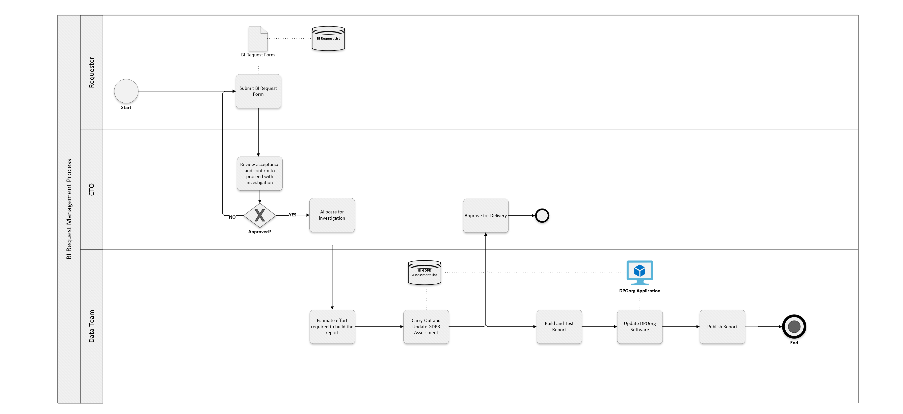
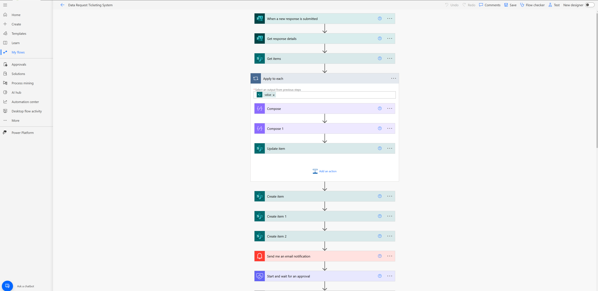
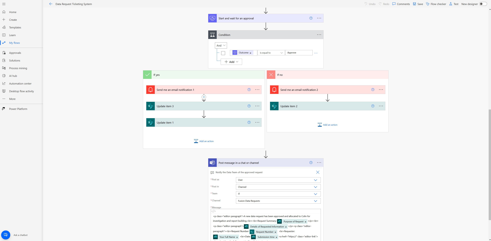

# Data Request Ticketing System with Power Automate

This repository contains the implementation of a **Data Request Ticketing System** designed using **Microsoft Power Automate** and **SharePoint**. The system automates the handling of data report requests, approvals, and notifications.

## Key Features:

- **Data Request Form:** Users submit data report requests through a form.
- **SharePoint Lists Integration:** 
  - Data request details are automatically mapped into **SharePoint Lists**:
    - BI Request List
    - GDPR Request List
- **Approval Workflow:** 
  - Two levels of approval:
    1. **CTO Approval:** The CTO approves the initial request.
    2. **Data Team Estimation:** The Data Team carries out an effort estimation for the request.
    3. **Final CTO Approval:** After estimation, the CTO gives the final approval.
- **Notifications:** 
  - Users are notified at each stage of the process:
    - Request received
    - Request approved
    - Data team starts working

## Technology Stack:

- **Power Automate**: For workflow automation.
- **SharePoint**: For data storage and tracking requests.
- **Email Notifications**: For sending updates to users.

## Connectors Used:

The following **Power Automate connectors** are used to create the seamless workflow in this system:

- **SharePoint Connector**:
  - Used to create, update, and manage items in SharePoint Lists (BI Request List, GDPR Request List).
  
- **Notification Connector**:
  - Used to send email notifications to users at various stages of the request process.
  
- **Approvals Connector**:
  - Handles approval processes by creating approval requests for the CTO and Data Team members.
  - **Start and Wait for an Approval**: Used to initiate the approval process and wait for a response (approval or rejection).

- **Apply to Each Connector**:
  - Used for iterating through multiple items (such as multiple request entries or approvers).
  
- **Compose Connector**:
  - Used to generate dynamic content, such as constructing a **Request Number** based on form inputs or other parameters.
  
- **Condition Connector**:
  - Used to evaluate whether the **CTO Approval** is granted or rejected and proceed based on the result.

- **Microsoft Teams Connector** (optional, if applicable):
  - Used for sending messages or notifications to specific Teams channels for tracking request progress.

## Process Map:

For a visual representation of the workflow, view the **[Process Map - BIRequestFlow V1.1](BIRequestFlow%20V1.1.vsdx)**. This diagram shows how the request flows through various stages, from submission to final approval.

## Power Automate Flow:

Here are the **Power Automate Flow Diagrams** that illustrate the automation process in detail:

